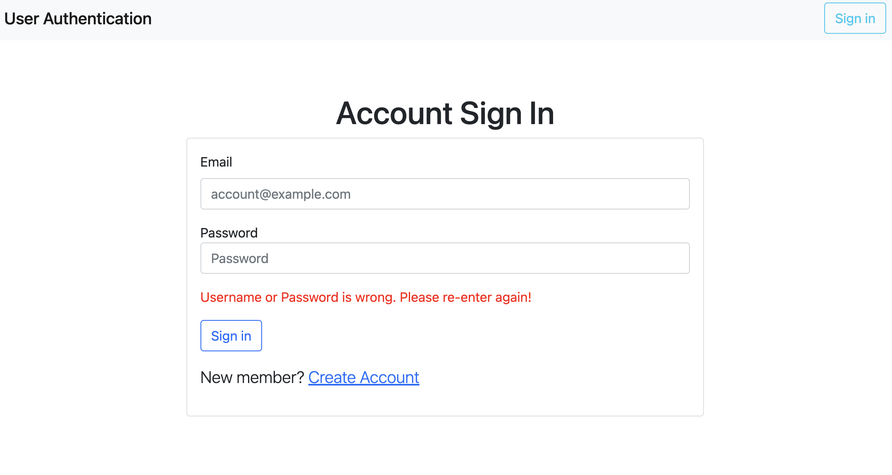

# User Authentication Function

Our website is a user authentication system that allows users to register, login, and logout. It provides a secure way to manage user accounts and control access to authenticated content. 

Homepage and register: New users can visit the homepage and choose to sign in. They provide their name, email and password to create a new account. The registration process ensures that the email is unique and not already associated with an existing account.


Login and authentication: They enter their credentials (email and password) and submit the form. If the entered account details are valid, the user is successfully logged in. However, if the account does not exist or the entered credentials are incorrect, an error message is displayed.



Member-only page: Upon successful login, users are directed to a restricted area of the website accessible only to authenticated users. They can browse through the authenticated content, such as personalized dashboards, exclusive features, or protected resources. If they want to sign out and stop using the service. The sign out button is showing based on the status of user authentication. 


## Prerequisites

Make sure you have the following software installed before running the application:

- Node.js
- Express
- Express-Handlebars
- Express-Session
- MongoDB and Robo3T (for database management)
- Mongoose (MongoDB object modeling tool)
- Passport
- Passport-Local

## Getting Started

1. Clone the repository or download the source code:
```
git clone https://github.com/scheng0718/login_function.git
```
2. cd to directory
```
cd login
```
2. Install the required dependencies using: 
```
npm install
```
3. Create a .env file in the root directory and provide the necessary environment variables:
```
MONGODB_URI=mongodb+srv://<your MongoDB account>:<your MongoDB password>@<mongodb server location(ex. cluster0.okrb8d7.mongodb.net)>/<database name (ex. login_function)>?retryWrites=true&w=majority
```
4. Run the application using:
```
npm run dev
```
5. When the messages pop up, the local host is running and MongoDB is connected 
```
The server is listening at http://localhost:3000
mongodb connected!
```
6. Please access the URL Shortener service through visiting in your web browser: 
```
http://localhost:3000
```
7. Enjoy using the login function
8. Terminate the local host service
```
ctrl + c
```

## Developer Tools

- Node.js: 14.16.0
- Npm: 6.14.11
- Express: 4.17.1
- Express-handlebars: 4.0.2
- Bootstrap: 5.3.0
- MongoDB: 6.0.6
- Mongoose: 5.9.18
- dotenv: 16.3.1
- cookie-parser: 1.4.6
- express-session: 1.17.3
- passport: 0.6.0
- passport-local: 1.0.0

## Contribution

Contributions to this user authentication function are welcome. If you find any issues or want to add new features, feel free to submit a pull request.

## Contributor

Evan Cheng